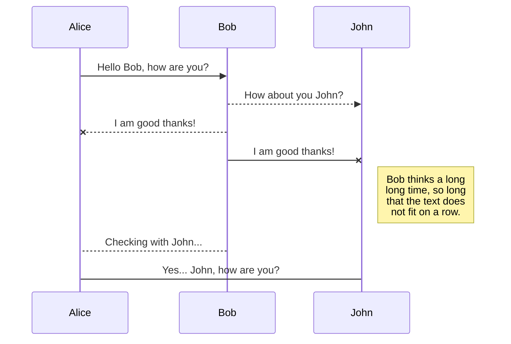
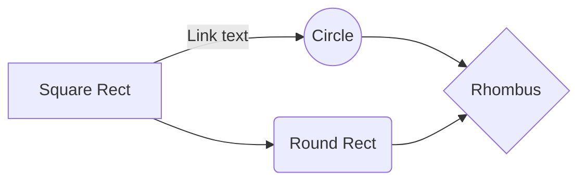

# FYP - RVMS (mobile)

This is a documentation + log of RVMS mobile version.

# 25Jun2022
**Done**
> Supabase setup, 
> Read from DB

## Announcements

 - [x] load all from db
 - [x]  load post by id **(errors) !!**

>   To do 
 - [ ] fix viewAnnouncement bugs

>     

## Feedbacks

 - [x] load all from db
 
>   To do 
 - [ ] load post by id
 - [ ] note: replied and pending feedback

## Visitors

 - [x] load all from db
 - [x] load post by id

## Home

>   To do 
 - [ ] front end
 - [ ] back end

# 26Jun2022

**To-do**
> CRUD of resident,
> CRUD of SG,
> CRUD of visitors

## Announcements

 - [x] fix viewAnnouncement bugs

>   To do -- none

## Visitors

 - [x] add to db
 
>   To do  
 - [ ] remove from db

## Feedbacks

 - [x] load post by id
 - [x] note: replied and pending feedback
 
>   To do 
 - [ ] add new feedback

## Home

>   To do 
 - [ ] front end
 - [ ] back end
 - [ ] read profile (do after auth)
 - [ ] update profile (do after auth)

# 27Jun2022

**To-do**
> CRUD of resident,
> CRUD of SG,
> CRUD of visitors

## Visitors

 - [x] remove from db

>   To do 
 - [ ] change style in figma

## Feedbacks

 - [x] add new feedback

>   To do 
 - [ ] feedback categories

## Home

>   To do 
 - [ ] front end
 - [ ] back end
 - [ ] read profile (do after auth)
 - [ ] update profile (do after auth)
 
 ## Visitor - use unit id and visitation id to login
 
>   To do 
 - [ ] read unit id and visitation id
 - [ ] generate qr code
 - [ ] checkInTime added -> navigate to next page
 
  ## Security guards 
  
  >   To do 
 - [ ] qr scanner -> add qr code and security id
 - [ ] add ad hoc visitor

  
  # 2 July 2022

**To-do**
> CRUD of resident (amendment),
> CRUD of SG,
> CRUD of visitors

## Visitors

 - [x] change style in figma
 - [x] change style in visitor card
 - [x] refactor visitor card
 
>   To do 
 - [ ] add visitor (unit id)
 - [ ] validation

## Feedbacks

 - [x] update feedback categories

>   To do 
 - [ ] validation

## Home

 - [x] front end
 - [x] back end

>   To do 
 - [ ] front end (amendment)
 - [ ] read profile (do after auth)
 - [ ] update profile (do after auth)
 
 ## Visitor - use unit id and visitation id to login
 
 - [x] read unit id and visitation id
 - [x] generate qr code
 - [x] navigate to next page
 
 >   To do 
 - [ ] prompt message when type wrong id
 - [ ] listen to payload (auto update page if checkin_time != null)

 
  ## Security guards 
   - [x] qr scanner -> add qr code
   
  >   To do 
 - [ ] qr scanner -> add checkin time and security id
 - [ ] add ad hoc visitor (unit_id )
 

  
  # 3 July 2022 & 7 July 2022

**To-do**
> Login (auth)

## Announcements

>   To do 
 - [ ] push notification

## Visitors
 
>   To do 
 - [ ] tab view
 - [ ] validation
 - [ ] add visitor (unit id)
 - [ ] return prompt message if no visitor

## Feedbacks

>   To do 
 - [ ] validation

## Home

>   To do 
 - [ ] front end (amendment)
 - [ ] read profile (do after auth)
 - [ ] update profile (do after auth)
 
 ## Visitor - use unit id and visitation id to login
 
 >   To do 
 - [ ] prompt message when type wrong id
 - [ ] listen to payload (auto update page if checkin_time != null)

 
  ## Security guards 
   
  >   To do 
 - [ ] qr scanner -> add checkin time and security id
 - [ ] add ad hoc visitor (unit_id )
 
 
   ## Login Auth
   
  >   To do 
 - [x] residents
 - [ ] security guards
 - [ ] management teams (web) (!! if need to configure tgt in db)

  
     ## Policy / RLS
     
     >   To do 
 - [ ] enable RLS
 - [ ] configure policy
  
  
    # 12 July 2022

## Announcements

>   To do 
 - [ ] push notification

## Visitors
  - [x] add visitor (unit id)
  
>   To do 
 - [ ] tab view
 - [ ] validation

 - [ ] return prompt message if no visitor

## Feedbacks

>   To do 
 - [ ] validation

## Home

 - [x] front end (amendment)
 - [x] read profile (do after auth)
 - [x] update profile (do after auth)
 
>   To do 
 - [ ] sytling

 ## Visitor - use unit id and visitation id to login
 
 >   To do 
 - [ ] prompt message when type wrong id
 - [ ] listen to payload (auto update page if checkin_time != null)

 
  ## Security guards 
   
  >   To do 
 - [ ] qr scanner -> add checkin time and security id
 - [ ] add ad hoc visitor (unit_id )
 
 
   ## Login Auth
   
 - [x] residents
 - [x] security guards
   
  >   To do 
 - [ ] management teams (web) (!! if need to configure tgt in db)

  
     ## Policy / RLS
     
     >   To do 
 - [ ] enable RLS
 - [ ] configure policy
----------------------------------------Reference--------------------------------------

## Open a file

You can open a file from **Google Drive**, **Dropbox** or **GitHub** by opening the **Synchronize** sub-menu and clicking **Open from**. Once opened in the workspace, any modification in the file will be automatically synced.

## Save a file

You can save any file of the workspace to **Google Drive**, **Dropbox** or **GitHub** by opening the **Synchronize** sub-menu and clicking **Save on**. Even if a file in the workspace is already synced, you can save it to another location. StackEdit can sync one file with multiple locations and accounts.

## Synchronize a file

Once your file is linked to a synchronized location, StackEdit will periodically synchronize it by downloading/uploading any modification. A merge will be performed if necessary and conflicts will be resolved.

If you just have modified your file and you want to force syncing, click the **Synchronize now** button in the navigation bar.

> **Note:** The **Synchronize now** button is disabled if you have no file to synchronize.

## Manage file synchronization

Since one file can be synced with multiple locations, you can list and manage synchronized locations by clicking **File synchronization** in the **Synchronize** sub-menu. This allows you to list and remove synchronized locations that are linked to your file.

# Publication

Publishing in StackEdit makes it simple for you to publish online your files. Once you're happy with a file, you can publish it to different hosting platforms like **Blogger**, **Dropbox**, **Gist**, **GitHub**, **Google Drive**, **WordPress** and **Zendesk**. With [Handlebars templates](http://handlebarsjs.com/), you have full control over what you export.

> Before starting to publish, you must link an account in the **Publish** sub-menu.

## Publish a File

You can publish your file by opening the **Publish** sub-menu and by clicking **Publish to**. For some locations, you can choose between the following formats:

- Markdown: publish the Markdown text on a website that can interpret it (**GitHub** for instance),
- HTML: publish the file converted to HTML via a Handlebars template (on a blog for example).

## Update a publication

After publishing, StackEdit keeps your file linked to that publication which makes it easy for you to re-publish it. Once you have modified your file and you want to update your publication, click on the **Publish now** button in the navigation bar.

> **Note:** The **Publish now** button is disabled if your file has not been published yet.

## Manage file publication

Since one file can be published to multiple locations, you can list and manage publish locations by clicking **File publication** in the **Publish** sub-menu. This allows you to list and remove publication locations that are linked to your file.

# Markdown extensions

StackEdit extends the standard Markdown syntax by adding extra **Markdown extensions**, providing you with some nice features.

> **ProTip:** You can disable any **Markdown extension** in the **File properties** dialog.

## SmartyPants

SmartyPants converts ASCII punctuation characters into "smart" typographic punctuation HTML entities. For example:

|                |ASCII                          |HTML                         |
|----------------|-------------------------------|-----------------------------|
|Single backticks|`'Isn't this fun?'`            |'Isn't this fun?'            |
|Quotes          |`"Isn't this fun?"`            |"Isn't this fun?"            |
|Dashes          |`-- is en-dash, --- is em-dash`|-- is en-dash, --- is em-dash|

## KaTeX

You can render LaTeX mathematical expressions using [KaTeX](https://khan.github.io/KaTeX/):

The *Gamma function* satisfying $\Gamma(n) = (n-1)!\quad\forall n\in\mathbb N$ is via the Euler integral

$$
\Gamma(z) = \int_0^\infty t^{z-1}e^{-t}dt\,.
$$

> You can find more information about **LaTeX** mathematical expressions [here](http://meta.math.stackexchange.com/questions/5020/mathjax-basic-tutorial-and-quick-reference).

## UML diagrams

You can render UML diagrams using [Mermaid](https://mermaidjs.github.io/). For example, this will produce a sequence diagram:

And this will produce a flow chart:

